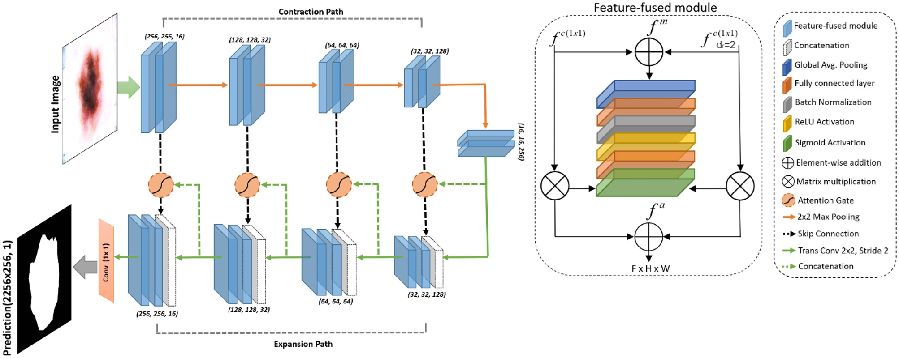

# FF-UNet

This repository contains the original implementation of "**[FF-UNet: a U-Shaped Deep Convolutional Neural Network for Multimodal Biomedical Image Segmentation](https://link.springer.com/article/10.1007/s12559-022-10038-y)**" in Keras (Tensorflow as backend). This paper has been published in "*Cognitive Computation - Springer*"

## Proposed Architecture:




## Pretrained weights:

Download from [**Google Drive**](https://drive.google.com/file/d/1FzRmNzoSxxNbvvSsUFMYrCwCqQTF58JO)

## Demo:

A demo can be found in [**Here**](https://github.com/ahmedeqbal/FF-UNet/blob/main/FF-UNet_implementation.ipynb)

# Requirements

- Python 3.7.11
- TensorFlow: 2.1.0
- Keras: 2.2.4
- OpenCV: 4.5.3
- Numpy: 1.19.1
- Matplotlib: 3.4.3

## Cite:

If you use FF-UNet in your project, please cite the following paper:
```
Iqbal, A., Sharif, M., Khan, M.A. et al. FF-UNet: a U-Shaped Deep Convolutional Neural Network for Multimodal Biomedical Image Segmentation. Cogn Comput (2022). https://doi.org/10.1007/s12559-022-10038-y
```
